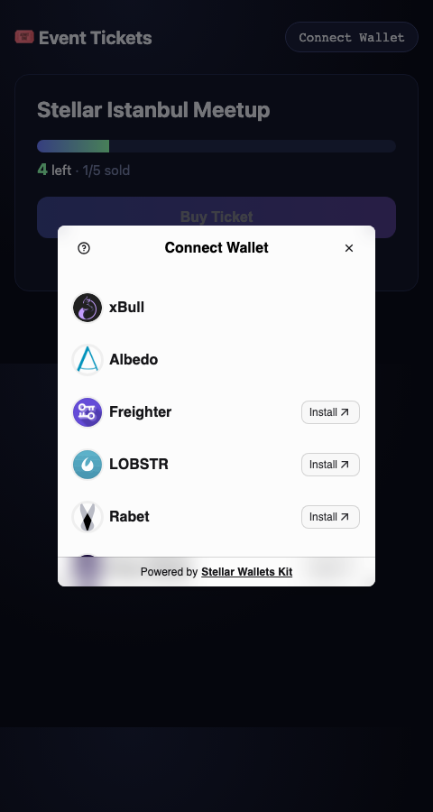

# 🎟️ Stellar Event Ticketing dApp

A multi-wallet Stellar dApp with a deployed Soroban smart contract, real-time event
integration, and visible transaction status. Built for **Bootcamp Level 2**.

## On-chain references (testnet)

| | |
|---|---|
| **Deployed contract** | `CCKGLLNUZ3SFTIG67WMV7TZ6IX6NYWPDPEVBAFL3L74SA2WNRZKN6BJA` |
| **Explorer (contract)** | https://stellar.expert/explorer/testnet/contract/CCKGLLNUZ3SFTIG67WMV7TZ6IX6NYWPDPEVBAFL3L74SA2WNRZKN6BJA |
| **Sample `buy_ticket` tx** | `fa36b397ba1587736b3a288f0b15ba86e61619d3ab54cce64a5d58ea6fb34464` |
| **Explorer (tx)** | https://stellar.expert/explorer/testnet/tx/fa36b397ba1587736b3a288f0b15ba86e61619d3ab54cce64a5d58ea6fb34464 |

## Screenshots

**Wallet options (Stellar Wallets Kit — multi-wallet):**



**App with live testnet data (1/5 sold):**


## What it does

A single event has a fixed ticket capacity. Anyone can connect a wallet and buy one
ticket. The capacity bar updates live as tickets sell, and every step of the
transaction is shown (pending → success/fail).

## Level 2 requirements — coverage

| Requirement | Where |
|-------------|-------|
| **3 error types handled** | `frontend/src/lib/errors.ts` → WalletNotConnected, UserRejected, ContractError (SoldOut / AlreadyHasTicket) |
| **Contract deployed on testnet** | `CCKGLLNU…N6BJA` (see above) |
| **Contract called from frontend** | `frontend/src/lib/contract.ts` → `getInfo`, `hasTicket` (read), `buyTicket` (write) |
| **Transaction status visible** | `idle → pending → success/fail` in `App.tsx` (button + toast) |
| **Real-time / events** | Contract emits `("ticket","buy")` event; UI re-reads `get_info` after each buy and refreshes the capacity bar |
| **Multi-wallet** | Stellar Wallets Kit: Freighter, xBull, Albedo, Lobstr, Rabet, Hana |

## Structure

```
contracts/ticket/        Soroban contract (Rust) + unit tests
frontend/                React + Vite + TypeScript app
  src/lib/wallet.ts        Stellar Wallets Kit (multi-wallet connect + sign)
  src/lib/contract.ts      build / simulate / sign / submit + reads
  src/lib/errors.ts        3-way error classification
  src/App.tsx              UI: capacity bar, buy button, status, recent buyers
docs/superpowers/specs/  Design spec
```

## Contract API

| Function | Description |
|----------|-------------|
| `initialize(admin, event_name, total_tickets)` | One-time setup |
| `buy_ticket(buyer) -> u32` | Buys one ticket, emits event, returns ticket number |
| `get_info() -> (name, total, sold)` | Read event state |
| `has_ticket(addr) -> bool` | Whether an address holds a ticket |

Errors: `NotInitialized(1)`, `AlreadyInitialized(2)`, `SoldOut(3)`, `AlreadyHasTicket(4)`.

## Run locally

**Frontend**
```bash
cd frontend
npm install
npm run dev          # http://localhost:5173
```
`frontend/.env` holds `VITE_CONTRACT_ID`, `VITE_RPC_URL`, `VITE_NETWORK_PASSPHRASE`.

**Contract (rebuild / redeploy)**
```bash
cargo test -p ticket
stellar contract build
stellar contract deploy --wasm target/wasm32v1-none/release/ticket.wasm \
  --source <identity> --network testnet
stellar contract invoke --id <CID> --source <identity> --network testnet -- \
  initialize --admin <identity> --event_name "My Event" --total_tickets 5
```

## Tech

- Soroban SDK 22, Rust, stellar CLI 27
- `@stellar/stellar-sdk` 16, `@creit.tech/stellar-wallets-kit` 2.4
- React 19 + Vite + TypeScript
